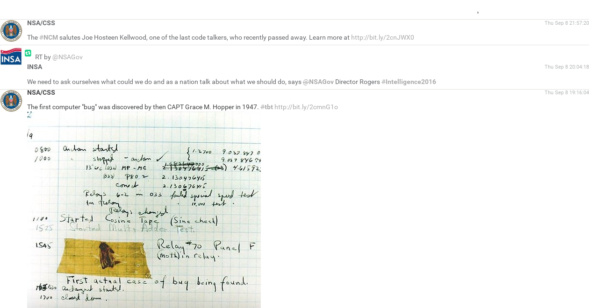

RTWOTA : Read Twitter WithOut Twitter Account

#Description
This repo has all you need to make read only twitter-like without twitter account

We get tweet with [RSS-Bridges](https://github.com/RSS-Bridge/rss-bridge)
put all tweets in a sqlite3 database (tweets.sqlite)
and we use php to show a timeline or a user timeline 

Exemple :


#Setup
Clone this repo on your web serveur where your want
Edite get_tweets.py to add account you want to follow, it's a python list 
Exemple :
```
  accounts = [ "nsa", "gchq" ]
```

Note : in this repo .htaccess is for forbidden access to the database (tweets.sqlite) and to get_tweets.py (the python file that get all your tweets)
This do the job for apache server

You have to setup a cron job to get new tweets each [time you when]
This is a exemple with a execution each 5 minutes
```
$ crontab -e 
```
then add this line to the file
```
*/5 * * * * python [path to your dir]/get_tweet.py  [path to your dir]/tweets.sqlite >/dev/null 2>&1
```

If you have or if your want to run your own RSS-Bridges, you should edit the url in get_tweets.py

You can also read your feed in CLI mode using ``` python TL.py [path_to_database] [1 if you want answers] ```

#Licence
The style.css file is coming from [myleneb/theme_nin](https://github.com/myleneb/theme_nin)


